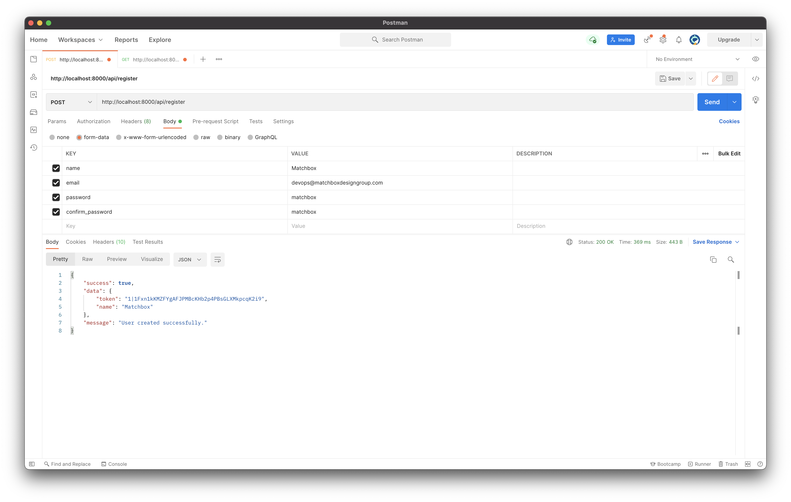
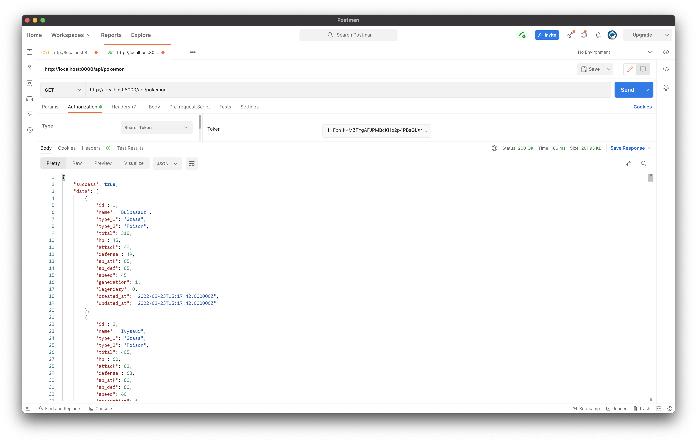

### Objective

Your assignment is to create a Pokémon API from a CSV file using PHP and Laravel.

### Brief

Professor Oak is in trouble! A wild Blastoise wreaked havoc in the server room and destroyed every single machine. There are no backups - everything is lost! Professor Oak quickly scribbles down all the Pokémon from memory and hands them to you on a piece of paper. (`./database/data/pokemon.csv`). Your task is to restore the Pokémon Database from that file and create a Pokémon API so that they’re never lost again.

### Tasks

-   Implement assignment using:
    -   Language: **PHP**
    -   Framework: **Laravel**
-   Create a Pokémon Model that includes all fields outlined in `./database/data/pokemon.csv`
-   Parse the .csv file and create entries for each row in the model by using a seeder
-   Create API auth endpoints for `/register` and `/login` that will return an Auth Token to be used as a Bearer Token in Postman. This will authenticate the user to make a GET rquest to your data endpoint.
-   Create one data API endpoint `/pokemon`
    -   This API endpoint should be searchable, filterable and paginatable
        -   Search: name
            -   Bonus: implement fuzzy search using Levenshtein distance
        -   Filter: HP, Attack & Defense
            -   e.g. `/pokemon?hp[gte]=100&defense[lte]=200`
        -   Pagination: e.g. `/pokemon?page=1`

## Postman (Expected Results)

### Evaluation Criteria

-   **PHP** best practices
-   Show us your work through your commit history
-   We're looking for you to produce working code, with enough room to demonstrate how to structure components in a small program
-   Completeness: did you complete the features?
-   Correctness: does the functionality act in sensible, thought-out ways?
-   Maintainability: is it written in a clean, maintainable way?
-   Testing: is the system adequately tested?

### CodeSubmit

Please organize, design, test and document your code as if it were going into production - then push your changes to the master branch. After you have pushed your code, you may submit the assignment on the assignment page.

All the best and happy coding,

The Matchbox Design Group Team
